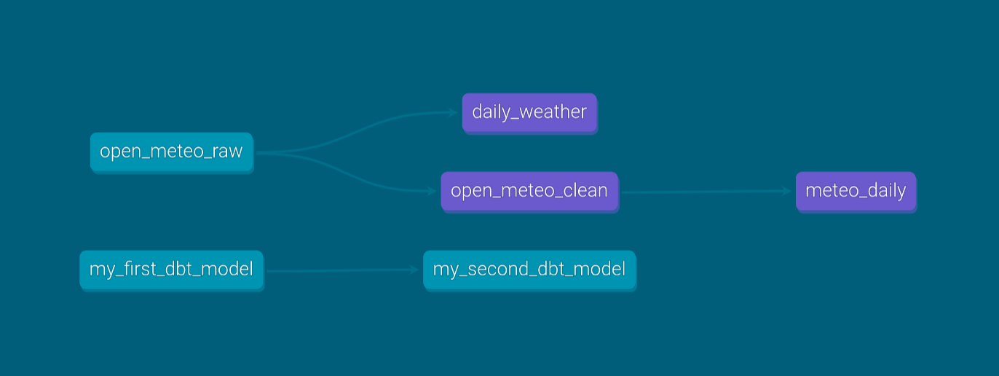

---
mdx:
  format: mdx
---

import Tabs from '@theme/Tabs';
import TabItem from '@theme/TabItem';

# Getting started

This page helps you get started with dbt-polars. It covers setting up a dbt-polars project and shows the main features of the library.

## Installing dbt-polars

```bash
pip install dbt-polars
```

## Initializing a dbt project

```bash
dbt init
```

`dbt init` asks a few questions to configure the dbt profile, which determines where and how dbt-polars writes data. For your first project, enter:

| Prompt | Value | Explanation |
|---|---|---|
| Project name | e.g. `weather` | Becomes the project folder name. |
| Database | `polars` | The adapter dbt uses to run your project, here: dbt-polars. |
| Schema | `main` (default) | Default schema for writing tables. For local catalog, it's the folder to which data is written. |
| Threads | `1` (default) | How many models dbt runs in parallel. Polars already parallelizes dataframe execution, so it's recommended to keep this at 1. |
| Catalog type | `local` | Catalogs determine where data is written. `local` writes to your local disk. |
| Root path | `./data` (default) | Folder where tables are written in the local catalog. |

`dbt init` creates a project folder with this structure:

```text
<project name>/
├── dbt_project.yml   # project settings, including which profile to use
├── models/           # SQL and Python models
│   └── example/      # example models created by dbt init
├── seeds/            # CSV files loaded with `dbt seed`
├── tests/            # singular data tests
├── macros/           # reusable SQL (Jinja) snippets
├── snapshots/        # snapshot definitions
└── analyses/         # SQL queries that are compiled but not run
```

See [About dbt projects](https://docs.getdbt.com/docs/build/projects) in the dbt documentation to learn more.

## Connecting to storage

dbt-polars out-of-the-box supports writing to local disk and popular cloud storage locations (Azure, Iceberg catalogs, Databricks). These integrations are called catalogs in dbt-polars. It's possible to create a custom catalog to integrate with storage not yet supported.

Below, we show a sample configuration of the dbt profile for different catalogs:

<Tabs groupId="catalog">
<TabItem value="local" label="Local" default>

Stores tables as files on your local disk. See [Local catalog](../catalogs/local.md).

Included in `dbt-polars`, no extra install needed.

```yaml
# <project folder>/profiles.yml
<project name>:
  target: dev
  outputs:
    dev:
      type: polars
      schema: main
      catalog_type: local
      root: ./data   # folder where tables are written; must not contain spaces
```

</TabItem>
<TabItem value="azure" label="Azure">

Stores tables as files on Azure Blob Storage or ADLS Gen2. See [Azure catalog](../catalogs/azure.md).

Install the Azure catalog (`dbt-polars-catalog-azure`):

```bash
pip install 'dbt-polars[azure]'
```

```yaml
# <project folder>/profiles.yml
<project name>:
  target: dev
  outputs:
    dev:
      type: polars
      schema: main
      catalog_type: azure
      account_name: mystorageaccount
      container: mycontainer
      # without credentials, DefaultAzureCredential is used (e.g. your Azure CLI login)
```

</TabItem>
<TabItem value="iceberg" label="Iceberg">

Stores tables in Apache Iceberg format, here with a SQLite metastore. Catalog options such as `uri` and `warehouse` are passed to pyiceberg's [`load_catalog`](https://py.iceberg.apache.org/configuration/), so any pyiceberg backend works (REST, Glue, Hive, …). See [Iceberg catalog](../catalogs/iceberg.md).

Install the Iceberg dependencies (`pyiceberg`):

```bash
pip install 'dbt-polars[iceberg]'
```

```yaml
# <project folder>/profiles.yml
<project name>:
  target: dev
  outputs:
    dev:
      type: polars
      schema: main
      catalog_type: iceberg
      uri: sqlite:///./catalog.db      # Iceberg metastore
      warehouse: file:///./warehouse   # folder where table data is written
```

</TabItem>
<TabItem value="databricks" label="Databricks">

Registers tables in Databricks Unity Catalog, without using Databricks compute. See [Databricks catalog](../catalogs/databricks.md).

Install the Databricks catalog (`dbt-polars-catalog-databricks`):

```bash
pip install 'dbt-polars[databricks]'
```

```yaml
# <project folder>/profiles.yml
<project name>:
  target: dev
  outputs:
    dev:
      type: polars
      schema: main
      catalog_type: databricks
      catalog_name: my_uc_catalog
      host: https://my-workspace.cloud.databricks.com
      token: "{{ env_var('DATABRICKS_TOKEN') }}"
```

</TabItem>
<TabItem value="custom" label="Custom">

Need a different storage backend? You can write your own catalog as a separate Python package and select it with `catalog_type`. See [Custom catalogs](../catalogs/custom.md).

Install your catalog package next to `dbt-polars`:

```bash
pip install <your-catalog-package>
```

```yaml
# <project folder>/profiles.yml
<project name>:
  target: dev
  outputs:
    dev:
      type: polars
      schema: main
      catalog_type: my_custom
      # options defined by your catalog
```

</TabItem>
</Tabs>

## Materializations

[Materializations](https://docs.getdbt.com/docs/build/materializations) determine how dbt writes data. `dbt-polars` supports `table`, `incremental` and `ephemeral` materializations. `view` materializations are not supported.

The project created via `dbt init` uses the `view` materialization. Change this in `dbt_project.yml`:

<div className="row">
<div className="col col--6">

**Created by `dbt init`**

```yaml {20-21}
# <project folder>/dbt_project.yml
name: '<project name>'
version: '1.0.0'

profile: '<project name>'

model-paths: ["models"]
analysis-paths: ["analyses"]
test-paths: ["tests"]
seed-paths: ["seeds"]
macro-paths: ["macros"]
snapshot-paths: ["snapshots"]

clean-targets:
  - "target"
  - "dbt_packages"

models:
  <project name>:
    example:
      +materialized: view
```

</div>
<div className="col col--6">

**Change to**

```yaml {20}
# <project folder>/dbt_project.yml
name: '<project name>'
version: '1.0.0'

profile: '<project name>'

model-paths: ["models"]
analysis-paths: ["analyses"]
test-paths: ["tests"]
seed-paths: ["seeds"]
macro-paths: ["macros"]
snapshot-paths: ["snapshots"]

clean-targets:
  - "target"
  - "dbt_packages"

models:
  <project name>:
    +materialized: table  # or ephemeral

```

</div>
</div>

All models are now materialized as tables, unless a model sets a different materialization.

## Running the project

From the project folder, run:

```bash
dbt run
```

When you use the local catalog with root `data/`, this generates the following files:

```text
<project name>/
└── data/                        # root path
    └── main/                    # schema name
        ├── my_first_dbt_model/  # dbt model
        │   ├── _delta_log/
        │   │   └── 00000000000000000000.json
        │   └── part-00001-<uuid>-c000.snappy.parquet
        └── my_second_dbt_model/
            ├── _delta_log/
            │   └── 00000000000000000000.json
            └── part-00001-<uuid>-c000.snappy.parquet
```

When you use a different catalog (Azure, Databricks, ...) this data is written to cloud storage instead.

## Loading data

For this example, we use hourly [weather data by Open-Meteo.com](https://open-meteo.com/). Download [open_meteo_raw.csv](https://github.com/datamindedbe/incubator-dbt-polars/raw/main/docs/demos/data/open_meteo_raw.csv) and put it in the `seeds/` folder. Then load it as a table:

```bash
dbt seed
```

This writes the `open_meteo_raw` table to `data/main/`, next to the example models.

## Transforming data

In dbt, each .py or .sql file in the `models` folder defines a model. A model is a data transformation which can be materialized as a table.

In `dbt-polars` both Python and SQL models are efficient, so pick the languague that fits the transformation. The code below calculates aggregates for the seeded weather data.

<Tabs>
<TabItem value="python" label="Python" default>

```text {7}
<project name>/
├── models/
│   ├── example/
│   │   ├── my_first_dbt_model.sql
│   │   ├── my_second_dbt_model.sql
│   │   └── schema.yml
│   └── daily_weather.py
└── seeds/
    └── open_meteo_raw.csv
```

```python
# <project name>/models/daily_weather.py
import polars as pl


def model(dbt, session) -> pl.LazyFrame:
    hourly: pl.LazyFrame = dbt.ref("open_meteo_raw")
    return (
        hourly.group_by("date")
        .agg(
            pl.col("temperature_2m").min().alias("min_temperature"),
            pl.col("temperature_2m").max().alias("max_temperature"),
            pl.col("precipitation").sum().alias("total_precipitation"),
        )
        .sort("date")
    )
```

`dbt.ref("open_meteo_raw")` returns the seeded table as a Polars LazyFrame.

</TabItem>
<TabItem value="sql" label="SQL">

```text {7}
<project name>/
├── models/
│   ├── example/
│   │   ├── my_first_dbt_model.sql
│   │   ├── my_second_dbt_model.sql
│   │   └── schema.yml
│   └── daily_weather.sql
└── seeds/
    └── open_meteo_raw.csv
```

```sql
-- <project name>/models/daily_weather.sql
select
    date,
    min(temperature_2m) as min_temperature,
    max(temperature_2m) as max_temperature,
    sum(precipitation) as total_precipitation
from {{ ref('open_meteo_raw') }}
group by date
order by date
```

`{{ ref('open_meteo_raw') }}` refers to the seeded table.

</TabItem>
</Tabs>

Run `dbt run` again to write the new `daily_weather` table.

## Ephemeral models

dbt supports [ephemeral models](https://docs.getdbt.com/docs/build/materializations#ephemeral). An ephemeral model is not written to storage. Like an intermediate function in Python, it is computed as part of every model that references it. This lets you split a large transformation into smaller steps, without storing each step as a table.

The ephemeral model `open_meteo_clean` below renames the column `temperature_2m` to `temperature`:

<Tabs>
<TabItem value="python" label="Python" default>

```python {6}
# <project name>/models/open_meteo_clean.py
import polars as pl


def model(dbt, session) -> pl.LazyFrame:
    dbt.config(materialized="ephemeral")
    hourly: pl.LazyFrame = dbt.ref("open_meteo_raw")
    return hourly.rename({"temperature_2m": "temperature"})
```

</TabItem>
<TabItem value="sql" label="SQL">

```sql {2}
-- <project name>/models/open_meteo_clean.sql
{{ config(materialized="ephemeral") }}

select
    time,
    temperature_2m as temperature,
    precipitation,
    date
from {{ ref('open_meteo_raw') }}
```

</TabItem>
</Tabs>

The `meteo_daily` model uses it to compute daily averages:

<Tabs>
<TabItem value="python" label="Python" default>

```python
# <project name>/models/meteo_daily.py
import polars as pl


def model(dbt, session) -> pl.LazyFrame:
    clean: pl.LazyFrame = dbt.ref("open_meteo_clean")
    return clean.group_by("date").agg(
        pl.col("temperature").mean(), pl.col("precipitation").mean()
    )
```

</TabItem>
<TabItem value="sql" label="SQL">

```sql
-- <project name>/models/meteo_daily.sql
select
    date,
    avg(temperature) as temperature,
    avg(precipitation) as precipitation
from {{ ref('open_meteo_clean') }}
group by date
```

</TabItem>
</Tabs>

After `dbt run`, `data/main/` contains a `meteo_daily` table, but no `open_meteo_clean`.

<div className="alert alert--info margin-bottom--md" role="note">SQL and Python models can be mixed freely. For example, the Python version of the ephemeral `open_meteo_clean` model can be combined with the SQL version of `meteo_daily`.</div>

## Generating docs

```bash
dbt docs generate
dbt docs serve
```

This creates and starts a documentation website for the dbt project. It includes a lineage graph showing how models depend on each other. For the project so far:



By using `ref` we enable dbt to collect this lineage. See [About documentation](https://docs.getdbt.com/docs/build/documentation) in the dbt documentation to learn more.

## Data tests

[Data tests](https://docs.getdbt.com/docs/build/data-tests) improve the reliability of your data. In dbt, data tests are placed in the `tests/` folder and return the rows that break a rule. Tests succeed when no rows are returned.

The test below fails when a daily average temperature is below -20°C or above 40°C:

<Tabs>
<TabItem value="python" label="Python" default>

```python
# <project name>/tests/meteo_daily_temperature_range.py
import polars as pl

def test(dbt, session):
    daily: pl.LazyFrame = dbt.ref("meteo_daily")
    return daily.filter((pl.col("temperature") < -20) | (pl.col("temperature") > 40))
```

<div className="alert alert--info" role="note">A Python test can also return a boolean, where `True` means the test passed.</div>

</TabItem>
<TabItem value="sql" label="SQL">

```sql
-- <project name>/tests/meteo_daily_temperature_range.sql
select *
from {{ ref('meteo_daily') }}
where temperature < -20 or temperature > 40
```

</TabItem>
</Tabs>

Run all tests with:

```bash
dbt test
```

## Incremental data ingestion

The seed from [Loading data](#loading-data) is a static file, so it never contains the latest weather data. A Python model can fetch the data itself, which brings ingestion into dbt.

Replace the seed `seeds/open_meteo_raw.csv` with a model `models/open_meteo_raw.py`. The name stays the same, so the models that reference it need no changes. Your folder structure is now:

```text {10}
<project name>/
├── models/
│   ├── example/
│   │   ├── my_first_dbt_model.sql
│   │   ├── my_second_dbt_model.sql
│   │   └── schema.yml
│   ├── daily_weather.py (or .sql)
│   ├── meteo_daily.py (or .sql)
│   ├── open_meteo_clean.py (or .sql)
│   └── open_meteo_raw.py
├── seeds/
│   └── .
└── tests/
    └── meteo_daily_temperature_range.py (or .sql)
```

The model below fetches hourly weather data from the Open-Meteo API:

1. `dbt.config(...)` makes the model `incremental`. With `delete+insert` and `unique_key="date"`, rows for a date that is fetched again replace the existing rows instead of being added twice. The table is stored as CSV.
2. `run_date` is yesterday.
3. On the first run, the model fetches all data from `START_DATE` until `run_date`. On later runs, `dbt.is_incremental` is true and it only fetches `run_date`.
4. The API response is returned as a Polars DataFrame, with a `date` column derived from the timestamp.

The model uses the `requests` library, which is not installed with dbt-polars:

```bash
pip install requests
```

```python
# <project name>/models/open_meteo_raw.py
import polars as pl
import requests

from datetime import date, timedelta

LATITUDE = 52.54833
LONGITUDE = 13.407822
START_DATE = date(2026, 1, 1)


def model(dbt, session) -> pl.DataFrame:
    dbt.config(
        materialized="incremental",
        incremental_strategy="delete+insert",
        unique_key="date",
        file_format="csv",
    )

    run_date = date.today() - timedelta(days=1)

    start_date = run_date if dbt.is_incremental else START_DATE

    response = requests.get(
        "https://archive-api.open-meteo.com/v1/archive",
        params={
            "latitude": LATITUDE,
            "longitude": LONGITUDE,
            "start_date": start_date.isoformat(),
            "end_date": run_date.isoformat(),
            "hourly": "temperature_2m,precipitation",
        },
    )
    response.raise_for_status()
    hourly = response.json()["hourly"]

    return (
        pl.DataFrame(
            {
                "time": hourly["time"],
                "temperature_2m": hourly["temperature_2m"],
                "precipitation": hourly["precipitation"],
            }
        )
        .with_columns(pl.col("time").str.to_datetime("%Y-%m-%dT%H:%M"))
        .with_columns(pl.col("time").dt.strftime("%Y-%m-%d").alias("date"))
    )
```

Build the table using either

```bash
dbt run --full-refresh  # reload the full table
```

or

```bash
dbt run # incremental ingestion
```

dbt automatically runs a full refresh for new models. Subsequent runs are by default incremental.


<div className="alert alert--info" role="note">

In production, `run_date` usually comes from your orchestrator. Pass it as an environment variable:

```bash
RUN_DATE=2026-10-05 dbt run
```

And read it in the model:

```python
import os

run_date = date.fromisoformat(os.environ["RUN_DATE"])
```

</div>
